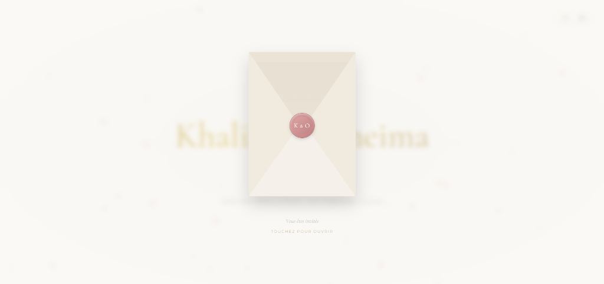

# ⚜️ Khalil & Oumeima - Wedding Invitation ⚜️

An elegant, premium, and bilingual (French & English) digital wedding invitation website built using React, Vite, TypeScript, and Motion.

<div align="center">
  
</div>

---

## ✨ Features

- **✉️ Interactive 3D Envelope**: A realistic letter-opening experience where guests click on a personalized wax seal (`K & O`) to reveal the wedding invitation.
- **🎵 Loopable Background Music**: Autoplays romantic background music (`Majida al roumi.mp3`) as soon as the envelope opens, complete with a smooth mute/unmute control on the floating action bar.
- **🌐 Bilingual Support (FR / EN)**: Dynamic language selector supporting French and English, translating all screens instantly.
- **⏳ Countdown Timer**: Live countdown displaying days, hours, minutes, and seconds remaining until the big day.
- **📅 Detailed Schedule (*Le Déroulé*)**:
  - **La Veille (Wteya)**: Friday, July 17, 2026, at Jardin De Mariage De Madame Daoud, Boumhal (Starting at 21:00).
  - **La Célébration**: Sunday, July 19, 2026, at Salle Des Fêtes La Reine, Ain Zaghouen (Starting at 21:00).
- **🎨 Premium Visual Identity**: Curated cream and gold color palette, soft bokeh particle background effects, custom typography, and fluid micro-animations.

---

## 🛠️ Tech Stack

- **Core**: React 19, TypeScript
- **Styling**: Tailwind CSS, CSS Variables
- **Animations**: Motion (formerly Framer Motion)
- **Icons**: Lucide React
- **Build Tool**: Vite 6

---

## 🚀 Getting Started

### Prerequisites
Make sure you have [Node.js](https://nodejs.org/) installed.

### Installation
1. Clone this repository or navigate to the project directory:
   ```bash
   npm install
   ```

2. Start the local development server:
   ```bash
   npm run dev
   ```
   *Note: If Windows path resolution fails due to the ampersand (`&`) in the folder name, you can run the server directly via Node.js:*
   ```bash
   node node_modules/vite/bin/vite.js --port=3000 --host=0.0.0.0
   ```

3. Open **[http://localhost:3000](http://localhost:3000)** in your browser to view the invitation.
